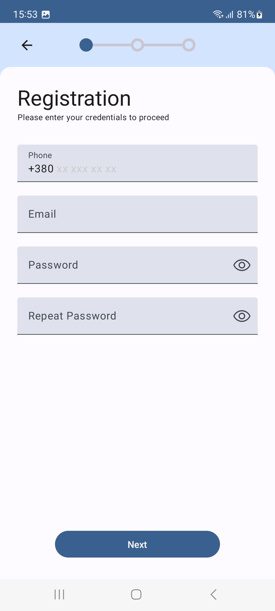

</img>

# MessengerApp

MessengerApp is an simple chat application developed using cutting-edge technologies. The frontend is built with Jetpack Compose, while the backend leverages Node.js and Nest.js.

This sample showcases:

* Implementation of Material Design 3 theming and utilization of Material You dynamic color for an aesthetically pleasing user interface.
* Seamless integration with socket.io, enabling real-time and efficient communication between clients.
* Integration of Pagging 3 with RemoteMediators for efficient data loading and pagination, enhancing performance and user experience.
* Development of a custom data adapter for Retrofit, enabling smooth and flexible data transmission.
* Integration with Architecture Components such as Navigation and ViewModel, leveraging their capabilities to enhance the app's functionality.
* Advanced text input and focus management techniques for seamless user interaction.
* Utilization of diverse animation and transition techniques to create engaging visual effects.
* Implementation of state persistence across configuration changes, ensuring a consistent and uninterrupted user experience.
* Implementing sticky header with Paging 3 and LazyList

## Screenshots

</img>
</img>
</img>
</img>
</img>
</img>
</img>

## Architecture

The architecture of MessengerApp follows the principles of the single source of truth pattern. The application retrieves data from the backend, which is then stored in the Room database. This approach allows for efficient management and retrieval of data, enabling smooth integration with various features. The utilization of Paging 3 with RemoteMediator facilitates efficient loading and pagination of data, providing users with a seamless browsing experience. The architecture also incorporates custom data adapters for Retrofit, ensuring flexible and reliable data transmission.